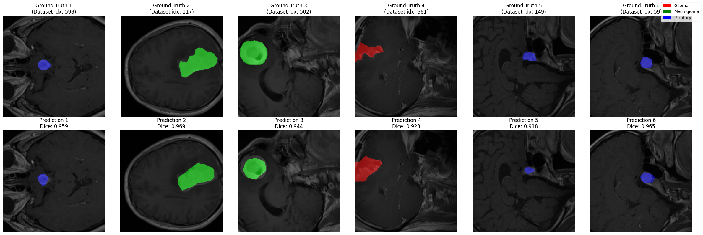
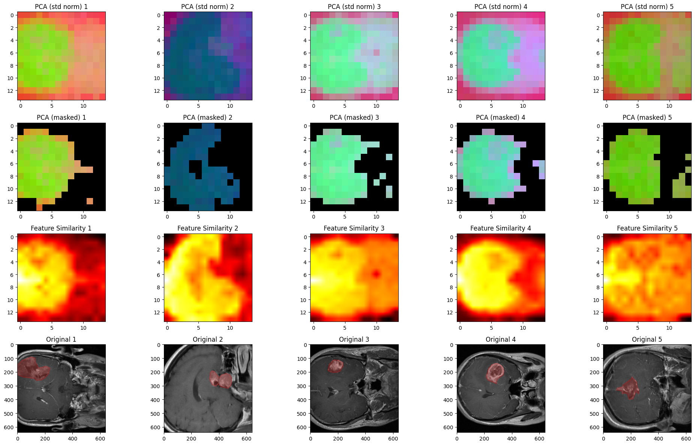

# DINOv3 Medical Image Segmentation Benchmark

A comprehensive benchmarking study comparing DINOv2 and DINOv3 vision transformers for brain tumor semantic segmentation using transfer learning.

## Project Overview

This project evaluates Facebook's latest DINOv3 foundation model against its predecessor DINOv2 for medical image analysis. Using transfer learning with custom segmentation heads, I achieved a **0.0337 Dice Score improvement** on brain tumor segmentation validation data, demonstrating the superior feature quality of DINOv3.

## Key Achievements

- **Model Performance**: Significant improvement in Dice Score using DINOv3 backbone (0.8433 vs 0.8096)
- **Feature Analysis**: Reproduced DINOv3 paper's PCA visualization technique on dense feature maps
- **Quality Insights**: Demonstrated higher feature variance in DINOv3, indicating improved representation quality
- **MLOps Integration**: Comprehensive experiment tracking with TensorBoard and model monitoring
- **Production-Ready**: FastAPI endpoint with client SDK for real-time inference

## Dataset

Brain tumor MRI scans from [Kaggle Medical Image Dataset](https://www.kaggle.com/datasets/pkdarabi/medical-image-dataset-brain-tumor-detection/data) with three tumor classifications:
- **Glioma**: Primary brain tumors from glial cells
- **Meningioma**: Tumors arising from protective membranes
- **Pituitary**: Tumors in the pituitary gland region

Dataset includes detailed polygon annotations with vertex coordinates defining tumor boundaries for precise semantic segmentation tasks.

## Technical Implementation

### Architecture

#### Vision Transformer Backbones (~80M parameters each)

**DINOv2-base**:
- **Layers**: 12 transformer layers
- **Hidden Size**: 768 dimensions
- **Attention Heads**: 12 heads
- **Patch Size**: 14×14 pixels
- **Input Resolution**: 224×224 (supports up to 518×518)
- **Tokens**: 257 total (1 CLS + 256 patch tokens)
- **Key Features**: LayerScale, GELU activation, QKV bias

**DINOv3-ViT-B/16**:
- **Layers**: 12 transformer layers  
- **Hidden Size**: 768 dimensions
- **Attention Heads**: 12 heads
- **Patch Size**: 16×16 pixels
- **Input Resolution**: 224×224
- **Tokens**: 201 total (1 CLS + 4 register + 196 patch tokens)
- **Key Features**: RoPE embeddings, register tokens, SwiGLU MLP option

#### Transfer Learning Strategy
- **Frozen Backbone**: Pre-trained weights remain fixed during training
- **Custom Segmentation Head**: Multi-layer CNN with progressive channel reduction
- **Head Architecture**: 768 → 256 → 128 → num_classes channels
- **Regularization**: Batch normalization, GELU activation, dropout (0.1)
- **Upsampling**: Bilinear interpolation to input resolution

#### Loss Function
- **Combined Loss**: Weighted Cross-Entropy (0.4) + Dice Loss (0.6)
- **Cross-Entropy**: Handles class imbalance and pixel-wise classification
- **Dice Loss**: Optimizes overlap between predicted and ground truth masks

### Key Components
- **Training Pipeline**: CLI-configurable training with hyperparameter management
- **Prediction Pipeline**: Streamlined inference workflow with model loading
- **API Service**: FastAPI deployment with RESTful endpoints
- **Experiment Tracking**: TensorBoard integration for comprehensive model monitoring
- **Feature Visualization**: PCA-based dense feature analysis from DINOv3 paper

## Repository Structure

```
├── src/
│   ├── components/           # Core ML components
│   │   ├── model_builder.py  # DINOSegmentation model architecture
│   │   ├── dataloaders.py    # Custom PyTorch DataLoaders
│   │   ├── engine.py         # Training/validation loops
│   │   ├── loss.py          # Combined loss functions
│   │   └── evaluation.py    # Metrics and evaluation
│   ├── pipeline/
│   │   ├── train.py         # CLI training pipeline
│   │   └── predict.py       # Inference pipeline
│   ├── api/
│   │   ├── app.py           # FastAPI application
│   │   └── client.py        # API client SDK
│   ├── config.py            # Configuration management
│   ├── logger.py            # Logging configuration and setup
│   ├── metrics.py           # Custom evaluation metrics
│   ├── utils.py             # Model saving/loading utilities
│   └── visualizations.py    # Plotting and visualization utilities
├── notebooks/
│   ├── eda.ipynb                      # Feature extraction & PCA analysis
│   ├── semantic_segmentation.ipynb    # Training with MLOps tracking
│   ├── patch_level_object_detection.ipynb  # Initial object detection approach
│   └── yolo_object_detection.ipynb         # Alternative object detection method
├── data/BrainTumor/         # Dataset directory
├── models/                  # Saved model checkpoints
├── runs/                    # TensorBoard experiment logs
└── demo.ipynb               # API demonstration notebook
```

## Key Notebooks

- **`eda.ipynb`**: Exploratory data analysis with feature extraction visualization
- **`semantic_segmentation.ipynb`**: Complete training pipeline with comprehensive MLOps tracking
- **`demo.ipynb`**: API demonstration and performance testing

## Results & Analysis

### Model Performance
- **DINOv2**: Overall Dice Score 0.8096 ± 0.1561
- **DINOv3**: Overall Dice Score 0.8433 ± 0.1227
- **Improvement**: 0.0337 increase demonstrating enhanced feature representation


*Semantic segmentation results showing model predictions overlaid on brain tumor MRI scans*

### Feature Quality Analysis
The PCA visualization technique reproduced from the DINOv3 paper revealed:
- Higher variance in DINOv3 principal components
- More discriminative patch-level features
- Better semantic clustering in feature space


*PCA visualization of DINOv3 feature embeddings showing dense feature representations and similarity maps*

## Quick Start

### Training
```bash
python src/pipeline/train.py --epochs 10 --batch_size 8 --base_model facebook/dinov3-vitb16-pretrain-lvd1689m
```

### API Deployment
```bash
uvicorn src.api.app:app --host 0.0.0.0 --port 8000
```

### Inference
```python
from src.api import SegmentationAPIClient

client = SegmentationAPIClient("http://localhost:8000")
result = client.predict_image("path/to/brain_scan.jpg")
```

## Technologies Used

- **Deep Learning**: PyTorch, Transformers (Hugging Face)
- **Computer Vision**: Torchvision, PIL
- **MLOps**: TensorBoard, experiment tracking
- **API**: FastAPI, Uvicorn
- **Data Science**: NumPy, Pandas, Scikit-learn
- **Visualization**: Matplotlib, advanced plotting techniques

## Future Enhancements

- Model ensemble methods for improved accuracy
- Real-time streaming inference capabilities
- Integration with medical imaging DICOM standards
- Advanced augmentation strategies for limited medical data